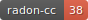
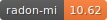

 
 
 
 
 

# Quantum Measurement Infrastructure

QMI is a Python 3 framework for controlling laboratory equipment. It is suitable for anything ranging from one-off
scientific experiments to robust operational setups.

QMI is developed by [QuTech](https://qutech.nl) to support advanced physics experiments involving quantum bits.
However, other than its name and original purpose, there is nothing specifically *quantum* about QMI — it is potentially
useful in any environment where monitoring and control of measurement equipment is needed.

## Copyright waiver
Technische Universiteit Delft hereby disclaims all copyright interest in the program QMI (Quantum Measurement Infrastructure), a lab instrument remote procedure call control framework written by the QuTech.
Professor Lieven Vandersypen, Director of Research QuTech

## Installation

Currently, no PIP installation is possible. Please clone and setup with `python setup.py install`.

## Documentation

To install the necessary packages to perform documentation activities for QMI do:

```
pip install -e .[rtd]
```

To build the 'readthedocs' documentation do:

```
cd documentation/sphinx
./make-docs
```

The documentation is then build in 'documentation/sphinx/build/html' and can be
viewed [here](documentation/sphinx/build/html/index.html).

## Contribute

For contribution guidelines see [CONTRIBUTING](CONTRIBUTING.md)
