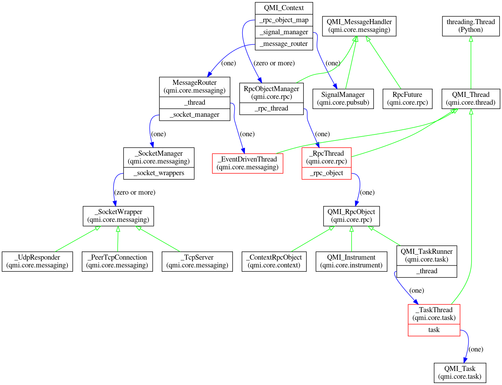
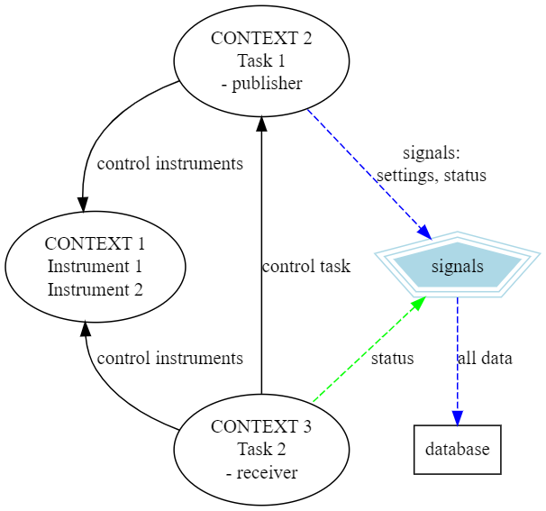
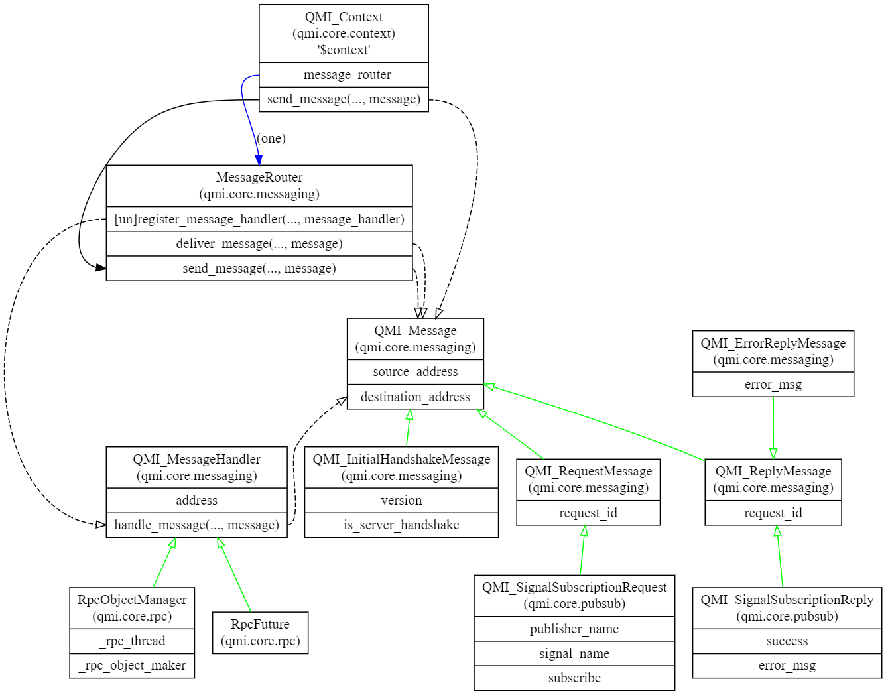
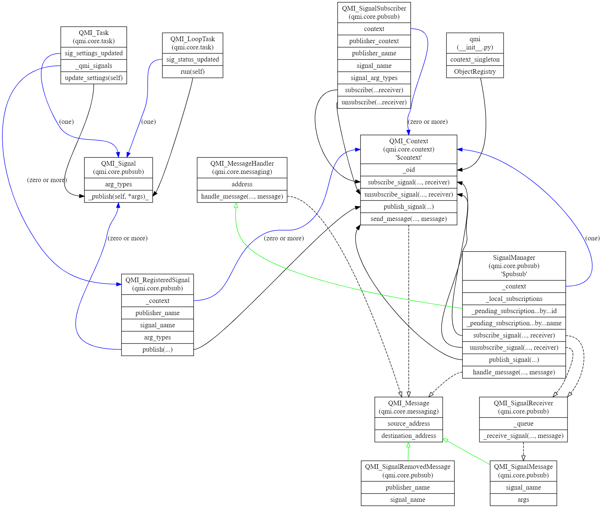

======
Design
======

This page describes the design of QMI.

Design Goals
------------

QMI was designed with the following goals in mind:

* **minimal dependencies**

  To the largest extent that is possible and practical, QMI is built on functionality that's available in Python's
  standard library. One particular choice we made was to implement our own RPC and networking functionality, rather
  than building on one of the numerous existing frameworks that provide that kind of functionality.

  The reason for this is twofold. First, many of those frameworks force you to write your programs in a certain style.
  This clashes with our design goal to make QMI suitable for users who are not primarily software engineers.
  Especially networking and RPC frameworks often force the use of a peculiar control flow with callbacks or another
  mechanism, that is hard to understand (and hence, to use properly) for non-programmers.

  Second, on the timescale of years and more, frameworks come and go; and it is often unclear which framework will
  survive and thrive over such timescales. Betting on the wrong framework (or one that will be seen as outdated in a
  few years time) will immediately limit the long-term prospects of the framework. We therefore mostly build on quite
  primitive functionality available in the standard library (like TCP sockets), that will be around for at least a
  couple of decades.

* **cross-platform**

  While in our own lab we tend to prefer Linux over Windows, it is also true that some devices can only realistically
  be used with MS Windows. Also, many potential users simply prefer Windows, or have no choice in the matter. It was
  therefore decided early on to make QMI cross-platform, supporting both Linux and Windows. As a pleasant side-effect,
  QMI will also work under macOS (since as a BSD-unix derivative, it is pretty close to Linux).

  QMI will also work perfectly well in a heterogeneous environment, with both Linux and Windows computers operating
  in the same network.

* **network transparency**

  QMI provides network transparency, which concretely means that instruments and tasks running in QMI can be monitored
  and controlled by other devices in the same network. To achieve this, a QMI process can connect to any other QMI
  process in the network, and connect to any instrument or task that it manages locally.

  This is especially useful to control USB devices and the like. In practice, one would often simply have one or more
  QMI processes running on a system that does nothing more than opening a number of (local) instruments. Such a process
  can then be contacted from any other QMI process, running on the same computer or another computer in the network,
  and that 'client' process can then access those instruments as if they were locally corrected. This mechanism does
  of course incur a penalty in terms of performance, but in most circumstances, this penalty is not relevant.

  Likewise, tasks can also be monitored and controlled over the network. An obvious example would be a control loop
  that can be monitored and/or controlled by some outside process, for example a graphical user interface.

* **API optimized for users who are not primarily software engineers.**

  QMI is designed in such a way that users (often physicists) do not usually need to know a lot about the internals
  of QMI to use it effectively. The API is simple and straightforward; the complexities of things like running
  multiple tasks in parallel, or accessing remote instruments and tasks as if they were local, are not normally
  visible to the user.

  In particular, QMI users should be able to write very small Python programs or scripts that do not require a
  lot of programming to successfully use QMI. For many applications, like simple measurements, a call to
  ``qmi.start()`` at the start of the script, followed by one or two calls to ``qmi.make_instrument()``, followed
  by a call to ``qmi.stop()``, is all it takes to successfully use QMI.

  Working in a lab environment a lot of time is usually spent on getting thinks to work at least somewhat, followed
  by a stage where one optimizes the behavior of the instruments and tasks, to the point where the intended
  functionality is achieved.

  This natural work-flow is nicely mirrored in the use of QMI. At first, a user would write one or a few very basic
  scripts that allows simple experimentation with all the instruments involved. As the understanding grows, the
  script(s) are developed until the user is satisfied with their performance. Some scripts will just remain in that
  form, which is perfectly fine. For example, a calibration procedure that will always be explicitly started could just
  be run as a QMI script when it is needed.

  In practice, some other types of scripts will be developed that are intended to be run automatically, or even permanently;
  the typical example of such a task would be a control loop. For these types of scripts, it will probably make sense to rework
  them into so-called QMI tasks, once the basic functionality is sufficiently developed and tested. The main advantage of a
  QMI task is that it can be monitored and controlled remotely. Furthermore, it is possible for a single Python process to
  execute multiple QMI tasks concurrently, through the magic of threads. This can be very useful in cases where you have
  essentially the same type of behavior (e.g., a control loop for a certain type of equipment), where multiple instances of this
  piece of equipment need to be controlled. This could be implemented in multiple processes, but it may be more convenient to
  have a single process that manages multiple tasks - for example, a "laser controller" script that manages three or four
  lasers with a similar interface, each with their own task.

Design Decision: use of threads
-------------------------------

One important design decision that was taken early on was that QMI will (heavily) use threading.

Threads have a reputation for being hard to use, and with good reason. It is perfectly possible to make very complicated programs
with lots of threads, and this can make debugging really hard. Also, the advantages of using threads in Python are not that you would
gain performance; Python implements a so-called *global interpreter lock* that makes threads a lot easier to use safely, but this puts
a hard limit on the performance gain to be gotten from thread usage in Python. Fortunately, in a lab environment, it is rare to have a
need for experimental scripts that are *CPU-bound*. In almost all circumstances, experimental code will be I/O-bound*. And in that case,
a judicious use of threads can keep code simple.

In QMI, threads are used in several places. One of the most important use is that each QMI instrument has its own private thread, that
encapsulates the opening, using, and closing of the instrument. All interaction with the instrument is done via this thread. (The
complicated mechanism to get this to work is hidden in QMI - a user will normally not even realize that the instrument isn't being used directly.)

This use of threads is especially advantageous in cases where a single QMI process is running multiple tasks. Each task can talk to its
instruments, and calls to that instruments will block that task -- but *not* other tasks! So tasks can run essentially independently of
one another, and don't have to worry about a device managed by some other task that reacts slowly, or takes a long time to process a request.

Some QMI instruments manage 'internal' threads as well; for example, an event time-tagger instrument may spontaneously emit data that
needs to be consumed in order to prevent buffer overruns. In QMI, this is generally solved by equipping such an instrument with a data consumer
thread that continuously reads data from the instrument and buffers it at the Python level.

Another important use of threads is in QMI tasks; these run in their own thread, making them independent of one another (and also of the program
running in the main thread).

We note here that there is an alternative to threads in modern Python, in the form of so-called asynchronous I/O and coroutines, which is now part
of the standard Python language with the 'async' keyword.

We decided against building asynchronous I/O for two reasons. First, an asyncio Python program still runs in a single thread, which is both a blessing
and a curse. First: if, for some reason, an asynchronous process does not yield control, all non-running co-routines will stop making progress. Second,
writing async-aware code currently requires users to have a pretty sophisticated understanding of what async is and how it works, in order to prevent
situations where a running sub- or coroutine doesn't yield control. We feel that this was too much of a burden on the users. In contrast, thread-based
code is pretty straight-forward, and doesn't require a lot of consideration for the fact that it is, in fact, running in a thread. While this is not true
in general, we like to think that it *is* true in QMI, where threads are not directly used and manipulated by the user, but always indirectly (mostly
via instruments or tasks).

In practice, we have seen preciously little problems caused by threads in QMI over a few years of heavy use. So we are pretty pleased with this
particular choice.

Features
--------

Most of the features of QMI have been touched on above:

* *Instruments* provide abstraction of lab equipment. QMI currently supports a few dozen instruments, with more to follow.
  Also, it should be relatively easy to add support for new instruments.

* *Tasks* provide an abstraction for behavior. This is mostly used for behavior that has an indefinite timespan,
  such as control loops, that are (almost) always active.

* *Network transparency* means that instruments and tasks can be accessed over the network. But the visibility and
  access should also be controllable so that these can be restricted to e.g. selected work groups. To hide a process
  from the default search of QMI contexts in the network, set the "workgroup" parameter in the QMI configuration to
  a specific string. Then, only searches which have as a selective parameter this workgroup name can find it. The
  default workgroup name is simply "default".

* *Cross platform support* means that we support Linux and Windows (and secondarily, also macOS).

* *Implemented in modern Python* means we're using Python 3, and intend to keep it up-to-date as Python evolves.

Design Overview
---------------

The figure above outlines the class inheritance and ownership relations of the most important classes in QMI.

The boxes in this graph denote *classes*. Classes with a red border are *active classes*, meaning they are running in a dedicated thread.

Green arrows denote *inheritance*, i.e., an 'is-a' relation between classes.

Blue arrows denote *ownership*. Ownerships arrows start in a named field of a class instance, and the arrow carries a label that shows how many
instances are owned, e.g., '(one)' or '(zero or more)'.

We discuss these classes below.

**QMI Contexts**
================

The **QMI_Context** class is the centralized entry-point to all functionality of QMI. A QMI process has a single **QMI_Context** that
is initialized by a call to ``qmi.start()`` and discarded by a call to ``qmi.stop()``. In between these calls, the context can be accessed
by a call to ``qmi.context()``. The configuration of a context is based on customized *@configstruct* data classes **CfgQmi** and **CfgContext**. These
are JSON-like structures and can be read in from a configuration file, or given as an argument input in ``qmi.start()``.

The QMI owns (directly or indirectly) all QMI-related objects in a process. Many of them are administrative in nature and will not normally
be accessed by the user, but the **QMI_Instrument** and **QMI_Task** instances are examples of user-accessible projects that are
managed and owned by the QMI_Context; the user merely gets a handle to them. **QMI_RpcObject** instances can also be directly accessed.

**Threading in QMI**
====================

The **QMI_Thread** class is a thin wrapper around bare Python threads, that support a common patterns for thread termination. The QMI_Thread is
for internal use within QMI only; it is emphatically *not* intended to be used by QMI users. We prefer to hide the complexity of thread management
as much as possible from QMI users, since they are error-prone and tend to lead to hard-to-understand code, in the hands of non software-engineers.

**Remote Procedure Calls**
==========================

One particularly important mechanism built on to of QMI messaging is RPC (remote procedure calls). Each RPC-capable object is represented by its own
**RpcObjectManager** that is owned by the **QMI_Context**. Its associated **_RpcThread** object owns a **QMI_RpcObject** and is responsible for executing
incoming RPC calls to the object. The incoming calls can be from the same context itself, but also from another context. This is made possible by
creating a proxy to the context in another context. **QMI_Context** can make and/or return a **QMI_RpcProxy** object of a running
**_RpcThread._rpc_object** instance, through the target **QMI_RpcObjectManager** mapped in *_rpc_object_map*.

The **_ContextRpcObject** answers RPC calls that can be made to the **QMI_Context** itself. A **QMI_Instrument** is a superclass for all equipment,
and equipment is generally also accessed by RPC calls (e.g. 'getVoltage()', 'setVoltage()'). A **QMI_TaskRunner** responds to a standardized set
of RPC methods that can be used to communicate with **QMI_Task** instances. Note in particular that tasks themselves are not RPC-capable objects!
This decision was made to keep the **QMI_Task** semantics as simple as possible; the all-important ``run()`` method of a QMI_Task does not
have to deal with the possibility that other methods can be run while it is active. This was deemed too error-prone and fragile for the intended
users of QMI. Instead of that, the **QMI_Task.run()** method is instructed to explicitly handle incoming requests in its main loop. This behavior is
highly stylized and, while strictly less powerful than supporting full RPC-capability, provides enough flexibility to handle the most common use-cases.

Example contexts
================

We could have as an example three contexts: In context one, we have made two instances of **QMI_Instrument** (e.g. A signal generator and an oscilloscope
on a lab PC). Then we have a second context, that runs a task, utilizing **QMI_LoopTask**, which is configured to make connection to context one, and to
control the instruments in it. This context could reside e.g. in an office PC close to the lab. This second contexts now sends also out *settings* and
*status* signals which can e.g. be forwarder to a database. Also on the office PC could run a third context that monitors the task status in context two
and instrument status in context one. This context is hooked in the *status* signal and at specific signal values or circumstances could either tell
context two to change settings or stop task, or send specific commands to the instruments in context one.

Blocking and Non-blocking Proxies
=================================

The RPC objects that run on other threads, in the same or other contexts, are controlled through their proxies. As shown before, these proxies are made to
**_RpcThread._rpc_object** instances of RPC objects. The regular **QMI_RpcProxy** object calls are *blocking*, meaning that when a RPC call is made, it
will not return until it is finished, blocking the thread of the object from handling other RPC calls in the meanwhile. The function
``blocking_rpc_method_call`` is used and this creates a ``future`` object with **QMI_RpcFuture**. This object then sends the RPC request message for the
method in question in the RPC call, and return the result or ``None`` of the call. Or exits with some exception.

As some calls might have long execution times or get stuck in a loop or e.g. slow instrument response, the blocking of the RPC object might result in an
overload of calls and a crash. For systems sensitive to this kinds of issues the proxy object has also ``rpc_nonblocking`` object as attribute, created by
calling **QMI_RpcNonBlockingProxy** with the same ``context`` and ``descriptor`` inputs. Lets assume a proxy to an object is made with

>>> proxy_instrument = qmi.get_instrument("context.instrument")

You would make a regular call with

>>> result = proxy_instrument.get_some_value()

Now this could block the script making this call, and the RPC object itself, until (or if!) it returns. Instead we can make a call

>>> result_future = proxy_instrument.rpc_nonblocking.get_some_value()
>>> assert isinstance(future, QMI_RpcFuture)
>>> # Could possibly do other calls here
>>> result = result_future.wait()  # Blocks this script only, not the RPC object

The call now uses function `non_blocking_rpc_method_call` that returns the **QMI_RpcFuture** object itself, and the result is then obtained in the
call script (if it should return one) or just wait until the call is finished.

Note that if the issue is slowly responding hardware, and several non-blocking calls are made which want to get a response from the hardware, this
could lead into unexpected hardware responses and/or other kinds of issues, and crashing of the code.

Further, the proxies have the possibility of *locking* their objects to be controlled by a specific context only. The use of the ``lock()``,
``unlock()``, ``force_unlock()`` and ``is_locked()`` methods are illustrated in the Tutorial.

**Context management**
======================

QMI offers a few context managers to facilitate better control of the QMI contexts, instruments, tasks and signals.

QMI contexts can be started and stopped with a `start_stop` context manager, available in ``qmi.utils.context_managers`` module.
The following code based on the ``with`` statement::

    with start_stop(qmi, "name"):
        custom_code_here ...

has the same effect as::

    qmi.start("name")
    try:
        custom_code_here ...
    finally:
        qmi.stop()

both ensuring that ``qmi.stop()`` will be called even when an error occurs in the custom code.

We can make instruments and tasks in the QMI context. For automatic opening and closing of an instrument driver instance
based on `QMI_Instrument`, we can do::

    with qmi.make_instrument("instrument_name", InstrumentClass, ...) as instr:
        custom_code_here...

which has the same effect as::

    instr = qmi.make_instrument("instrument_name", InstrumentClass)
    instr.open()
    try:
        custom_code_here...
    finally:
        instr.close()

Alternatively, the `open_close` context manager,from ``qmi.utils.context_managers`` can be used, but this context manager
will be obsoleted. That option requires making the instrument instance first and then giving it as an input to the context manager.

For tasks we can use the context management protocol to automatically start the task thread when entering a task's `QMI_LoopTask` context,
and stopping and joining to it at exit. Similar to the instrument, we can do::

    with qmi.make_task("task_name", TaskClass, ...) as task:
         task_code_here...

And the task should be stopped and joined after the task is finished. In the ``qmi.utils.context_managers`` is also context manager
`start_stop_join` to do this, but it will be obsoleted.

Further context managers in ``qmi.utils.context_managers`` are `lock_unlock` and `subscribe_unsubscribe` context managers.
The `lock_unlock` manager is meant for RPC objects that the user wants to lock while they are used by some script or task.
Typical use::

    some_instr = qmi.get_instrument(...)
    with lock_unlock(some_instr):
        priviledged_code_here...

The `lock_unlock` context manager accepts also extra input arguments, so that `timeout` and `lock_token` arguments can
also be given for the context manager.

And the final `subscribe_unsubscribe` context manager is meant to be used with signals. For example, a task has signal
named `sig_send_data` in the task's class. And we want to subscribe to it to receive data updates. If a task is f.ex.
obtained from another context, and we want to receive in `data_receiver`::

    signal_task = qmi.get_task(...)
    data_receiver = QMI_SignalReceiver()
    with subscribe_unsubscribe(signal_task.sig_send_data, data_receiver):
        data = data_receiver.get_next_signal()

If the task is 'running' and publishing data, the receiver should receive the data from it and then unsubscribe from
the signal again. Forgetting to unsubscribe from the signal could possibly lead to memory issues if the receiver is
still present, because then the published data could keep accumulating into the receiver queue.

**Messaging**
=============

The network facilities of QMI are managed by a number of closely-related classes. QMI networking is based on *messages* that can be delivered to
instances of class **MessageHandler** (an abstract class). This class has several subclasses that can serve as the target for QMI messages:
the **RpcObjectManager** which handles RPC requests for one particular RPC-capable object, the **SignalManager** which handles publish-subscribe
type communications, and the **RpcFuture**, which represents the result of a pending RPC call (for example, to an instrument).

The **MessageRouter** is a class that is capable of local and remote delivery of messages. Remote messages travel over TCP as pickled classes, whereas
local message delivery skips the pickle/unpickle step and is therefore much more efficient. The MessageRouter has a *_socket_manager* that manages
a bunch of 'live' sockets; the **UdpResponder** manages a single datagram socket that responds to UDP (broadcast) messages that are used to
enumerate all QMI processes in a given network; a **PeerTcpConnection** is a live, bi-directional connection to another network-accessible QMI_Context;
at any given the, the local QMI_Context may have sockets open to multiple QMI_Contexts in other processes or even computers. The single **TcpServer**
allows other QMI_Sockets to initiate a **PeerTcpConnection** to us.

Message delivery among a set of QMI processes is always point-to-point; there is no routing. If a QMI process needs to exchanges messages with some
other QMI process, it will need to have an active, direct **PeerTcpConnection**.

Messaging more in detail
========================

The figure above outlines the class inheritance, ownership, parameter type and usage relations of the QMI messaging and signalling.

Green arrows denote *inheritance*, i.e., an 'is-a' relation between classes.

Blue arrows denote *ownership*. Ownerships arrows start in a named field of a class instance, and the arrow carries a label that shows how many
instances are owned, e.g., '(one)' or '(zero or more)'.

Black dashed arrows with open arrow heads means that a method call's argument or arguments are of class type of target.

Black arrows with full arrow heads means that a method is implemented and/or called in the target class method.

The **QMI_Message** can have multiple instances with unique source and destination addresses. The **QMI_RequestMessage** and **QMI_ReplyMessage**
classes take a *request_id*, which is generated when making a request, as a random 64-bit integer string. **QMI_InitialHandshakeMessage** is sent when making a connection
to a peer, trialling if the connection can receive messages. By messaging errors, a **QMI_ErrorReplyMessage** is formulated with descriptive message and sent.

All the messages are subclasses of **QMI_Message** and at delivery routed through the **MessageRouter.send_message** of the context.

**Signalling**
==============

A closely related group of classes to messaging are the *signalling* classes. RPC objects can be set to contain signals that broadcast data. The **SignalManager**
class takes care of publishing data via signals and handling (pending) subscriptions of receivers that would like to listen to the broadcast.
In **QMI_Task** and **QMI_LoopTask** there are "settings" and "status" signals, respectively, as standard signals. The user can modify these signals to broadcast
the wanted data. By a simple **QMI_Task** object the request to broadcast settings has to be done manually, or be done in a custom loop. The **QMI_LoopTask** instead
has a standard loop that updates both "settings" (from parent class) and "status" and, if implemented in some *Task*, publishes these signals. It also
publishes data from custom signals, if implemented.

Signals, being it publishers or receivers, can be added to any RPC object, but the use of those will need more manual work. For example, when a
QMI task or tasks are made to be part of a *service*, the service can then be made to control the signalling (also between tasks) and data publication.

Signalling more in detail
=========================

The figure above outlines the class inheritance, ownership, parameter type and usage relations of the QMI messaging and signalling.

Green arrows denote *inheritance*, i.e., an 'is-a' relation between classes.

Blue arrows denote *ownership*. Ownerships arrows start in a named field of a class instance, and the arrow carries a label that shows how many
instances are owned, e.g., '(one)' or '(zero or more)'.

Black dashed arrows with open arrow heads means that a method call's argument or arguments are of class type of target.

Black dashed arrows with full arrow heads means that a method is used and/or implemented in the target class method.

From this fourth figure it can be seen how the subscribing and unsubscribing of receivers to signals are done via the **QMI_Context** methods, and also publishing of
data is routed via it. This way the QMI context can keep an object registry of which broadcasts it should listen to and which data to publish.
The signals use **QMI_SignalMessage** to broadcast signals between contexts. Each context owns exactly one **SignalManager** instance. The signal subscription and
unsubscribing is routed to **QMI_SignalSubscriber** class. The subscription of signals is done by using **QMI_SignaSubscriptionReply** which inherits from the **QMI_ReplyMessage**.
Subscription and unsubscribing requires as *receiver* input parameter an instance of **QMI_SignalReceiver**, which contains a queue of received signals.
When any such signal gets published, the published signal is automatically added to the receive queue of the **QMI_SignalReceiver**.

The *_queue* of **QMI_SignalReceiver** is from *collections.deque*.

Publishing of a signal is implemented in **QMI_RegisteredSignal.publish** which is an implementation of the abstract base class **QMI_Signal**.
Actual publishing happens in **QMI_context** when *publish_signal* method of the context is called. After that it is available for any receivers.

Logging
=======

QMI makes use of Python's built-in ``logging`` module, and logs data in a log file. The default name and location is `$QMI_HOME/qmi.log`. If the
environmental variable ``QMI_HOME`` is not set, it defaults to the user's home directory. The name of the log file can be customized by giving another name
in ``CfgLogging.logfile`` instance of ``CfgQmi.logging`` configuration entry. If the logger is started normally (not in DEBUG mode), using ``qmi.start``
with ``console_loglevel=`` keyword argument, the default logging level to console can be adjusted. Or it can be set in the configuration file.

Further, in the configuration file the log level of all modules' loggers can be set with ``loglevel`` keyword argument, or module-specifically with
``loglevels`` keyword argument. The latter requires as input a string: string dictionary.
An example of a logging setup in ``qmi.conf`` could be::

    "logging": {
        "loglevel": "WARNING",
        "console_loglevel": "ERROR",
        "logfile": "focus_on_task_and_rpc.log"
        "loglevels": {
            "qmi.core.task": "INFO",
            "qmi.core.rpc": "INFO"
    }
In this example we raise the generic loglevel to "WARNING" and console loglevel to "ERROR" so that logging "INFO" entries will not come to the log file,
and we will see only "ERROR" level messages on the console. Then, we set the logging to be done in a special log file with only *qmi.core.task* and *qmi.core.rpc*
modules logging everything starting from the "INFO" level. This could be useful when an user wants to filter out other modules' "INFO" messages to
focus more on what is going on in a task and its RPC calls.

the possible options are "INFO" (default log level), "WARNING" (default for console log level), "DEBUG", "CRITICAL",
"FATAL", "ERROR", "WARN", "NOTSET". "DEBUG" should not be used directly, but rather via the ``QMI_DEBUG``
environment variable. By setting ``QMI_DEBUG`` as environmental variable (to any value), at ``qmi.start()`` call both log levels to
log file and to console are set into "DEBUG" level.
