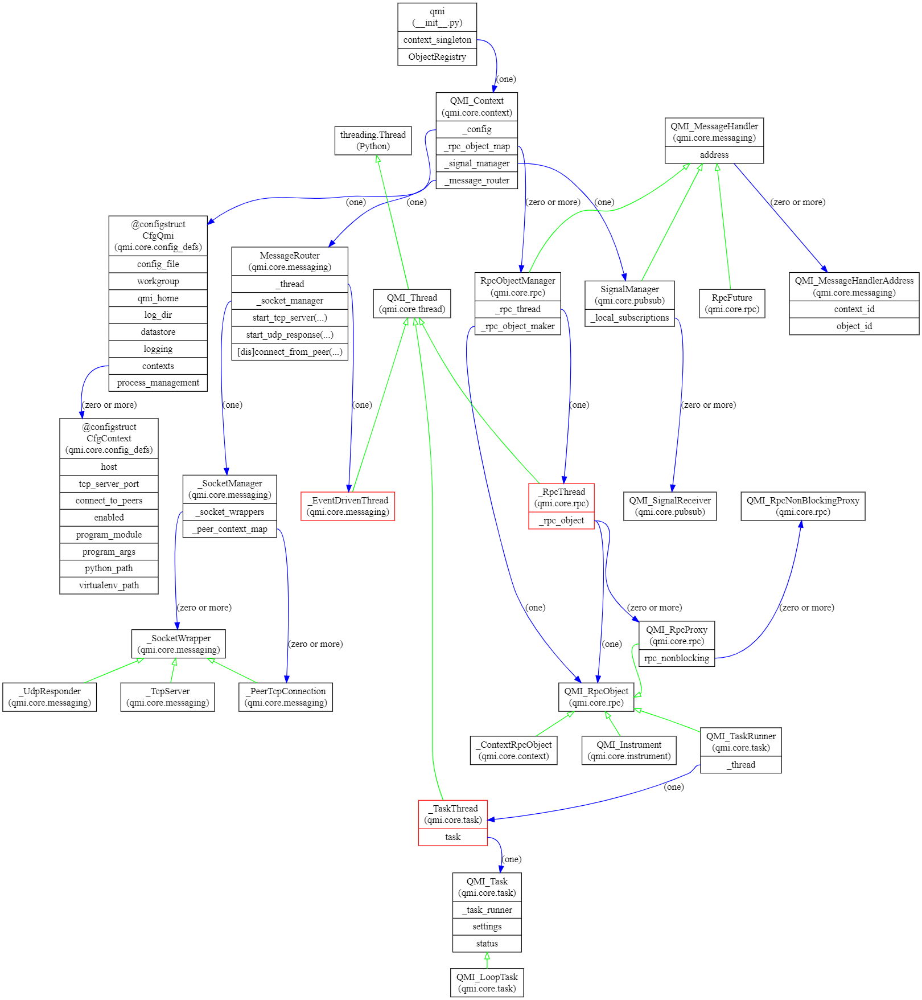

======
Design
======

THis page describes the design of QMI.

Design Goals
------------

QMI was designed with the following goals in mind:

* **minimal dependencies**

  To the largest extent that is possible and practical, QMI is built on functionality that's available in Python's
  standard library. One particular choice we made was to implement our own RPC and networking functionality, rather
  than building on one of the numerous existing frameworks that provide that kind of functionality.

  The reason for this is twofold. First, many of those frameworks force you to write your programs in a certain style.
  This clashes with our design goal to make QMI suitable for users who are not primarily software engineers.
  Especially networking and RPC frameworks often force the use of a peculiar control flow with callbacks or another
  mechanism, that is hard to understand (and hence, to use properly) for non-programmers.

  Second, on the timescale of years and more, frameworks come and go; and it is often unclear which framework will
  survive and thrive over such timescales. Betting on the wrong framework (or one that will be seen as outdated in a
  few years time) will immediately limit the long-term prospects of the framework. We therefore mostly build on quite
  primitive functionality available in the standard library (like TCP sockets), that will be around for at least a
  couple of decades.

* **cross-platform**

  While in our own lab we tend to prefer Linux over Windows, it is also true that some devices can only realistically
  be used with MS Windows. Also, many potential users simply prefer Windows, or have no choice in the matter. It was
  therefore decided early on to make QMI cross-platform, supporting both Linux and Windows. As a pleasant side-effect,
  QMI will also work under macOS (since as a BSD-unix derivative, it is pretty close to Linux).

  QMI will also work perfectly well in a heterogeneous environment, with both Linux and Windows computers operating
  in the same network.

* **network transparency**

  QMI provides network transparency, which concretely means that instruments and tasks running in QMI can be monitored
  and controlled by other devices in the same network. To achieve this, a QMI process can connect to any other QMI
  process in the network, and connect to any instrument or task that it manages locally.

  This is especially useful to control USB devices and the like. In practice, one would often simply have one or more
  QMI processes running on a system that does nothing more than opening a number of (local) instruments. Such a process
  can then be contacted from any other QMI process, running on the same computer or another computer in the network,
  and that 'client' process can then access those instruments as if they were locally corrected. This mechanism does
  of course incur a penalty in terms of performance, but in most circumstances, this penalty is not relevant.

  Likewise, tasks can also be monitored and controlled over the network. An obvious example would be a control loop
  that can be monitored and/or controlled by some outside process, for example a graphical user interface.

* **API optimized for users who are not primarily software engineers.**

  QMI is designed in such a way that users (often physicists) do not usually need to know a lot about the internals
  of QMI to use it effectively. The API is simple and straightforward; the complexities of things like running
  multiple tasks in parallel, or accessing remote instruments and tasks as if they were local, are not normally
  visible to the user.

  In particular, QMI users should be able to write very small Python programs or scripts that do not require a
  lot of programming to successfully use QMI. For many applications, like simple measurements, a call to
  ``qmi.start()`` at the start of the script, followed by one or two calls to ``qmi.make_instrument()``, followed
  by a call to ``qmi.stop()``, is all it takes to successfully use QMI.

  Working in a lab environment a lot of time is usually spent on getting thinks to work at least somewhat, followed
  by a stage where one optimizes the behavior of the instruments and tasks, to the point where the intended
  functionality is achieved.

  This natural work-flow is nicely mirrored in the use of QMI. At first, a user would write one or a few very basic
  scripts that allows simple experimentation with all the instruments involved. As the understanding grows, the
  script(s) are developed until the user is satisfied with their performance. Some scripts will just remain in that
  form, which is perfectly fine. For example, a calibration procedure that will always be explicitly started could just
  be run as a QMI script when it is needed.

  In practice, some other types of scripts will be developed that are intended to be run automatically, or even permanently;
  the typical example of such a task would be a control loop. For these types of scripts, it will probably make sense to rework
  them into so-called QMI tasks, once the basic functionality is sufficiently developed and tested. The main advantage of a
  QMI task is that it can be monitored and controlled remotely. Furthermore, it is possible for a single Python process to
  execute multiple QMI tasks concurrently, through the magic of threads. This can be very useful in cases where you have
  essentially the same type of behavior (e.g., a control loop for a certain type of equipment), where multiple instances of this
  piece of equipment need to be controlled. This could be implemented in multiple processes, but it may be more convenient to
  have a single process that manages multiple tasks - for example, a "laser controller" script that manages three or four
  lasers with a similar interface, each with their own task.

Design Decision: use of threads
-------------------------------

One important design decision that was taken early on was that QMI will (heavily) use threading.

Threads have a reputation for being hard to use, and with good reason. It is perfectly possible to make very complicated programs
with lots of threads, and this can make debugging really hard. Also, the advantages of using threads in Python are not that you would
gain performance; Python implements a so-called *global interpreter lock* that makes threads a lot easier to use safely, but this puts
a hard limit on the performance gain to be gotten from thread usage in Python. Fortunately, in a lab environment, it is rare to have a
need for experimental scripts that are *CPU-bound*. In almost all circumstances, experimental code will be I/O-bound*. And in that case,
a judicious use of threads can keep code simple.

In QMI, threads are used in several places. One of the most important use is that each QMI instrument has its own private thread, that
encapsulates the opening, using, and closing of the instrument. All interaction with the instrument is done via this thread. (The
complicated mechanism to get this to work is hidden in QMI - a user will normally not even realize that the instrument isn't being used directly.)

This use of threads is especially advantageous in cases where a single QMI process is running multiple tasks. Each task can talk to its
instruments, and calls to that instruments will block that task -- but *not* other tasks! So tasks can run essentially independently of
one another, and don't have to worry about a device managed by some other task that reacts slowly, or takes a long time to process a request.

Some QMI instruments manage 'internal' threads as well; for example, an event time-tagger instrument may spontaneously emit data that
needs to be consumed in order to prevent buffer overruns. In QMI, this is generally solved by equipping such an instrument with a data consumer
thread that continuously reads data from the instrument and buffers it at the Python level.

Another important use of threads is in QMI tasks; these run in their own thread, making them independent of one another (and also of the program
running in the main thread).

We note here that there is an alternative to threads in modern Python, in the form of so-called asynchronous I/O and coroutines, which is now part
of the standard Python language with the 'async' keyword.

We decided against building asynchronous I/O for two reasons. First, an asyncio Python program still runs in a single thread, which is both a blessing
and a curse. First: if, for some reason, an asynchronous process does not yield control, all non-running co-routines will stop making progress. Second,
writing async-aware code currently requires users to have a pretty sophisticated understanding of what async is and how it works, in order to prevent
situations where a running sub- or coroutine doesn't yield control. We feel that this was too much of a burden on the users. In contrast, thread-based
code is pretty straight-forward, and doesn't require a lot of consideration for the fact that it is, in fact, running in a thread. While this is not true
in general, we like to think that it *is* true in QMI, where threads are not directly used and manipulated by the user, but always indirectly (mostly
via instruments or tasks).

In practice, we have seen preciously little problems caused by threads in QMI over a few years of heavy use. So we are pretty pleased with this
particular choice.

Features
--------

Most of the features of QMI have been touched on above:

* *Instruments* provide abstraction of lab equipment. QMI currently supports a few dozen instruments, with more to follow.
  Also, it should be relatively easy to add support for new instruments.

* *Tasks* provide an abstraction for behavior. This is mostly used for behavior that has an indefinite timespan,
  such as control loops, that are (almost) always active.

* *Network transparency* means that instruments and tasks can be accessed over the network. But the visibility and
  access should also be controllable so that these can be restricted to e.g. selected work groups.

* *Cross platform support* means that we support Linux and Windows (and secondarily, also macOS).

* *Implemented in modern Python* means we're using Python 3, and intend to keep it up-to-date as Python evolves.

Design Overview
---------------

The figure above outlines the class inheritance and ownership relations of the most important classes in QMI.

The boxes in this graph denote *classes*. Classes with a red border are *active classes*, meaning they are running in a dedicated thread.

Green arrows denote *inheritance*, i.e., an 'is-a' relation between classes.

Blue arrows denote _ownership_. Ownerships arrows start in a named field of a class instance, and the arrow carries a label that shows how many
instances are owned, e.g., '(one)' or '(zero or more)'.

We discuss these classes below.

* The **QMI_Context** class is the centralized entry-point to all functionality of QMI. A QMI process has a single **QMI_Context** that
  is initialized by a call to qmi.start() and discarded by a call to qmi.stop(). In between these calls, the context can be accessed
  by a call to qmi.context().

  The QMI owns (directly or indirectly) all QMI-related object in a process. Many of them are administrative in nature and will not normally
  be accessed by the user, but the **QMI_Instrument** and **QMI_Task** instances are examples of user-accessible projects that are
  managed and owned by the QMI_Context; the user merely gets a handle to them.

* The network facilities of QMI are managed by a number of closely-related classes. QMI networking is based on *messages* that can be delivered to
  instances of class **MessageHandler** (an abstract class). This class has several subclasses that can serve as the target for QMI messages:
  the **RpcObjectManager** which handles RPC requests for one particular RPC-capable object, the **SignalManager** which handles publish-subscribe
  type communications, and the **RpcFuture**, which represents the result of a pending RPC call (for example, to an instrument).

  The **MessageRouter** is a class that is capable of local and remote delivery of messages. Remote messages travel over TCP as pickled classes, whereas
  local message delivery skips the pickle/unpickle step and is therefore much more efficient. The MessageRouter has a *SocketManager* that manages
  a bunch of 'live' sockets; the **UdpResponder** manages a single datagram socket that responds to UDP (broadcast) messages that are used to
  enumerate all QMI processes in a given network; a **PeerTcpConnection** is a live, bi-directional connection to another network-accessible QMI_Context;
  at any given the, the local QMI_Context may have sockets open to multiple QMI_Contexts in other processes or even computers. The single **TcpServer**
  allows other QMI_Sockets to initiate a **PeerTcpConnection** to us.

  Message delivery among a set of QMI processes is always point-to-point; there is no routing. If a QMI process needs to exchanges messages with some
  other QMI process, it will need to have an active, direct **PeerTcpConnection**.

* One particularly important mechanism built on to of QMI messaging is RPC (remote procedure calls). Each RPC-capable object is represented by its own
  **RpcObjectManager** that is owned by the QMI_Context. Its associated **_RpcThread** object owns a **QMI_RpcObject** and is responsible for executing
  incoming RPC calls to the object.

  The **_ContextRpcObject** answers RPC calls that can be made to the QMI_Context itself. A **QMI_Instrument** is a superclass for all equipment,
  and equipment is generally also accessed by RPC calls (e.g. 'getVoltage()', 'setVoltage()'). A **QMI_TaskRunner** responds to a standardized set
  of RPC methods that can be used to communicate with **QMI_Task** instances. Note in particular that tasks themselves are not RPC-capable objects!
  This decision was made to keep the **QMI_Task** semantics as simple as possible; the all-important 'run()' method of a QMI_Task does not
  have to deal with the possibility that other methods can be run while it is active. This was deemed too error-prone and fragile for the intended
  users of QMI. Instead of that, the QIM_Task's run() method is inspected to explicitly handle incoming requests in its main loop. This behavior is
  highly stylized and, while strictly less powerful than supporting full RPC-capability, provides enough flexibility to handle the most common use-cases.

* The **QMI_Thread** class is a thin wrapper around bare Python threads, that support a common patterns for thread termination. The QMI_Thread is
  for internal use within QMI only; it is emphatically *not* intended to be used by QMI users. We prefer to hide the complexity of thread management
  as much as possible from QMI users, since they are error-prone and tend to lead to hard-to-understand code, in the hands of non software-engineers.
